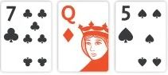
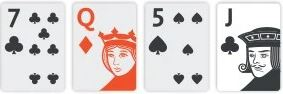
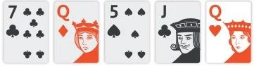

# ▪ Texas Hold'em

## The Beginning

&#x20;When playing texas hold'em poker, each player is dealt two cards face down - called their hand (hole cards). Then there is a betting round where you can Fold, Bet, or Fold. This stage of the game is known as pre-flop, and what you should do depends on your hand cards, or your starting hand.

When all bets have closed, three shared cards are dealt face up in the middle of the table. This is called the **flop.**

<figure><figcaption>
<strong>FLOP</strong>
</figcaption></figure>

## During the game&#x20;

Then there is another round of betting when a fourth shared card - called the **turn** - is dealt.

<figure><figcaption>
<strong>TURN</strong>
</figcaption></figure>

Then there is another round of betting, and then a final shared card - called the **river** - and a final round of betting.

<figure><figcaption>
<strong>RIVER</strong>
</figcaption></figure>

Your best Texas Holdem hands will be made using your hand cards and the five shared cards in between to make the best possible 5-card poker hand.

**What are the best hands in Texas Holdem poker?**

You can go to the poker hand rankings page for more information.

For example, if you have 9-9 and the shared cards are 9-9-A-5-2 you have four repeats. If the shared cards were J-Q-K-7-2 you would have only two nines

Sometimes the best hand in texas hold em is made up of the five shared cards themselves. If they were 10-10-10-10-A and you had 9-9, your hand would not be worth as much as the four highest-value repeats displayed on the table

## Game Ending&#x20;

There are two ways to end a round.

One is when the players in a round open their hand cards and the player with the best hand wins. This is known as the showdown.

The other is when someone bets enough so that everyone else passes. This is how most rounds end in Texas Hold'em and that's the magic of the game - you don't always need the best hand to win.
